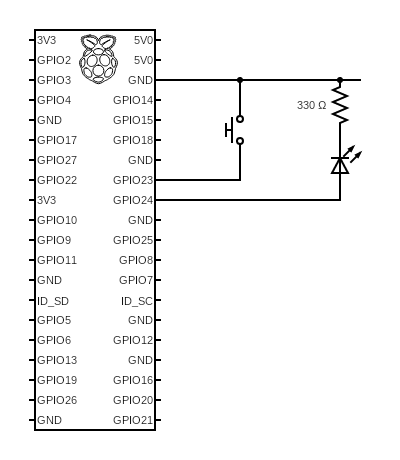

# Build a circuit and run some code
> kjhsc kajhsd  sakh dkasjhd ajksdh akjs dh 
sjahd kahs dkash dkash daks hdka sdhah ds
> jhas dkjha dkah sdkjah sdkah sdkjahsdka h


## Build a circuit
Component List
- LED (The short leg is know as the `cathode` and is connected to the 0V/GND, the longer leg is the `anode` and is connected to the Raspberry Pi GPIO pin)
- 330ohm resistor. Larger values are ok, eg 1k, 2k, etc.. the larger it is the dimmer the LED will be
- push to make switch
- GPIO Breakout Expansion Board inc Ribbon Cable (to get the Raspberry Pi 40-way GPIO connector onto a breadboard). This is optional in that you could just use female->male breadboard jumper wires. This one from [Amazon.co.uk](https://www.amazon.co.uk/dp/B07KB3JF68) works great. However, it will consume a lot of space on the breadboard.
- breaboard jumper wires (male->male)

Use a breadboard and build the circuit. Ensure the Raspberry is powered down for this to remove the possibility of shorting pins whilst constructing the circuit. Check wiring before powering/booting up the Raspberry Pi




## Enhance the application code
We will enhance the application we created in `Part 2` and add some additional code that will allow you to read the state of a switch and flash the LED when it is push/depressed. If you create a new project, then you must remember to make all the modifications to the `launch.json` and `tasks.json` files that were described in `Part 2`. It demonstrates the principles of using both an `input` GPIO pin and an `output` GPIO pin. Within these instructions, I've used `$` to denote Raspberry Pi commands and `>` to indicate windows command prompt (cmd.exe) commands. 
Let me know if you spot any errors so that I can correct them. Make sure you start off in your home directory (in my case C:\Users\dave).
The instructions assume you've completed the previous two steps (`Part 1` and `Part 2`).
## Load up the Visual Code project
Run the Command Prompt `cmd.exe` and then run up Visual Studio Code with teh application we created in `Part 2`
```
> code MyFirstApp
```
Select the `Program.cs` file and you should see something simple like this
```C#
1    // See https://aka.ms/new-console-template for more information
2    Console.WriteLine("Hello, World!");
```
## Configure the application for GPIO
We now need to add some of the GPIO code, but before we can do that we need to add the `package` that contains the GPIO library. To do this, click on the `Terminal` tab in the bottom window and type
```
dotnet add package System.Device.Gpio
```
You should see something like this
```
Determining projects to restore...
  Writing C:\Users\dave\AppData\Local\Temp\tmp6661.tmp
info : Adding PackageReference for package 'System.Device.Gpio' into project 'C:\Users\dave\MyFirstApp\MyFirstApp.csproj'.
info :   GET https://api.nuget.org/v3/registration5-gz-semver2/system.device.gpio/index.json
info :   OK https://api.nuget.org/v3/registration5-gz-semver2/system.device.gpio/index.json 401ms
info : Restoring packages for C:\Users\dave\MyFirstApp\MyFirstApp.csproj...
info : Package 'System.Device.Gpio' is compatible with all the specified frameworks in project 'C:\Users\dave\MyFirstApp\MyFirstApp.csproj'.
info : PackageReference for package 'System.Device.Gpio' version '2.0.0' added to file 'C:\Users\dave\MyFirstApp\MyFirstApp.csproj'.
info : Committing restore...
info : Generating MSBuild file C:\Users\dave\MyFirstApp\obj\MyFirstApp.csproj.nuget.g.targets.
info : Writing assets file to disk. Path: C:\Users\dave\MyFirstApp\obj\project.assets.json
log  : Restored C:\Users\dave\MyFirstApp\MyFirstApp.csproj (in 93 ms).
```
Excellent, we've now added the GPIO library so it will understand when we reference our GPIO pins. Alongside the `Terminal` tab, is `Debug Console` and `Output`. Click on `Output` which is the default. 
## Add GPIO code to the application
Insert a line at the top of the file to say we will be `using` the library
```C#
using System.Device.Gpio;

```
We now need to add some addition lines, so copy the following code and paste it at the end of the `Program.cs` file.
```C#

int pinSwitch = 23;
int pinLED = 24;

GpioController myController = new GpioController (PinNumberingScheme.Logical);

// Set up the two GPIO pins, one as input (switch) and the other as output (LED)

myController.OpenPin (pinSwitch, PinMode.InputPullUp);
myController.OpenPin (pinLED, PinMode.Output, PinValue.Low);

while (true) {
    if (myController.Read (pinSwitch) == PinValue.Low) {    // Switch has been pushed
        for (int loop = 0;loop < 3;loop++) {
            myController.Write (pinLED, PinValue.High);     // Switch on LED
            Thread.Sleep (300);
            myController.Write (pinLED, PinValue.Low);      // Switch off LED
            Thread.Sleep (300);
        }
    }
    Thread.Sleep (100);   // Wait 100ms and check the switch
}
```
## Source Code notes
- Pin numbers are specified using the `logical` (`PinNumberingScheme.Logical`) notation. This is how they are referenced using the GPIO chip on the Raspberry Pi. However, the alternative is `PinNumberingScheme.Board` which means the pin numbers are references to the pin numbers on the 40-pin GPIO interface. Whilst physical board numbers seems easy, a lot of the .NET functions (`PinChangeEventHandler`) always report GPIO pins using the `logical` pin number, so probably best to adhere to that. I chose to put the switch on GPIO (Logical) 23, which is equivalent to GPIO (Board) pin 16, the LED is on GPIO (Logical) 24, which is equivalent to GPIO (Board) pin 18.
- `PinMode.InputPullUp` means that the input GPIO pin will be pulled high (3.3v) unless the switch pulls it low (GND).
- The `Thread.Sleep()` call will sleep/delay the application for a number of milliseconds. 300 milliseconds gives a pleasing pulse, but feel free to change it.
- [Switch Bounce](https://www.allaboutcircuits.com/technical-articles/switch-bounce-how-to-deal-with-it/), whilst you think you might be closing the switch and it changes from one state to another, be aware that the switch will bounce in a sub-millisecond timeframe between both states before settling down. The code above wont expose that anomaly but if you start using event handlers it may become obvious. 
## Run the code
On the left hand side, click the `Run and Debug` symbol and then at the top select the `.NET Core Launch (remote)` and then click on the `Start Debugging` or `F5`. Once it says `Hello World` in the `Output` window you know your code is running. Push that button/switch and you should see the LED flash three times.
## References
If you want to draw circuits, there's a great online resource [here](https://www.circuit-diagram.org/)
