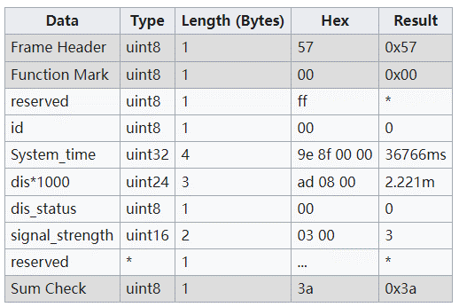
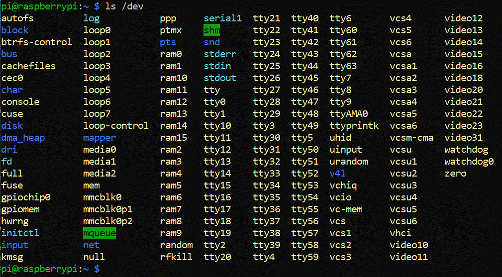
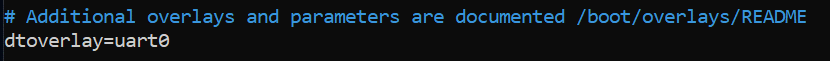
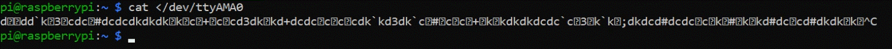
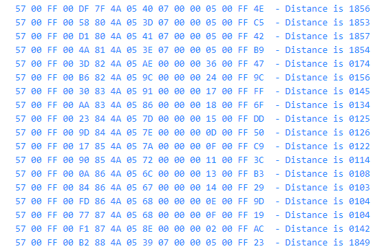

# Raspberry Pi + .NET + UART/Serial Port
## Introduction
In this episode we'll look at using the Raspberry Pi to write some code to read from the UART/Serial port. To help us generate some input from the UART port we're going to use a sensor that will measure the distance to a remote object. The sensor will then report the distance on the UART port. This is done using a Time of Flight sensor/algorithm.

There are many use cases for wanting to use a distance sensor, but as an example I use one in my garage. The distance sensor is placed on the front wall of the garage. As the car is driven into the garage, the distance sensor works out the distance between the car and the front garage wall. As the car gets closer to the wall and the distance gets shorter, the Raspberry Pi displays an indication as to whether the car is fully enclosed in the garage such that its safe to close the garage door. This distance is 1.5m (1500mm). I can then safely close the garage door knowing the car is far enough into the garage.
## Time of Flight Sensor
One of the most common Time of Flight sensors is the [VL53L1X sensor](https://www.st.com/resource/en/datasheet/vl53l1x.pdf) from STMicroElectronics. This sensor uses a Class1 940nm invisible laser, together with a laser-ranging sensor accurate up to 4m, producing measurements up to 50 times a second. The time of flight algorithm measures the time from sending a laser pulse to the time it's reflected and received on the sensor. To give you a sense of the speed, light travels 300,000km per second, if an object is 5m away, the time difference between the light leaving the laser and returning is roughly 33 nanoseconds (0.000000033 seconds)! Measuring 1cm would take 67 pico seconds!


## Sensor Availability
The sensor is commonally available as an I2C device and can be found at [Pimoroni](https://shop.pimoroni.com/products/vl53l1x-breakout?variant=12628497236051), [The Pi Hut](https://thepihut.com/products/time-of-flight-tof-distance-ranging-sensor-vl53l1x), [Sparkfun](https://www.sparkfun.com/products/14722), [Amazon](https://www.amazon.co.uk/VL53L1X-Flight-Distance-Carrier-Regulator/dp/B07DM2TKKL), [AdaFruit](https://www.adafruit.com/product/3967) etc. However, for our purposes, we're not going to use `I2C` but an enhanced version that generates UART traffic. This is the Waveshare version of this sensor, available from [The Pi Hut](https://thepihut.com/products/time-of-flight-tof-laser-range-sensor).
## Waveshare Time Of Flight (TOF) Laser Range Sensor
A [Product Wiki and User Guide](https://www.waveshare.com/wiki/TOF_Laser_Range_Sensor) is available that helps understand the traffic/bytes that are generated by this sensor. Whilst it's possible to `write` configuration parameters to the sensor, we're going to use the `default` settings. These are; `short` ranging scope (upto 2.16m) and `921600bps` Baud Rate. The sensor will continuously produce distance measuring packets according to a protocol packet. It looks like this:
```
Frame Header + Function Mark + Data + Check Sum
```
and it will repeatedly send this packet. The packet contains 16 bytes so we will have to process those bytes and understand their meaning. An example packet might look like this:

\
and that translates to:

\
We will have to write the code to synchronise with these packets from the UART port and interpret the distance. We're basically looking for the `Frame Header` and `Function Mark`, then the intervening bytes making sure that `dis_status` is `zero` and that the `Sum Check` (Check Sum) is valid. The `distance` is represented as three bytes and measures millimetres. To make this all come together we need to accomplish three steps;
- Wire up the sensor to the Raspberry Pi
- Configure the Raspberry Pi so that the UART Port works
- Write some .NET code to read the data from the UART Port
## Wire up the sensor to the Raspberry Pi
When you purchase the Waveshare TOF Sensor, it comes with a connector specifically designed for breadboarding and the Raspberry Pi. The cable has a plug that connects to the sensor, with four coloured wires coming out of it;
- VCC (RED) which connects to GPIO Pin 4 (5V)
- GND (BLACK) which connects to GPIO Pin 6 (GND/0V)
- RX (BLUE) which connects to GPIO Pin 8 (TXD) 
- TX (YELLOW) which connects to GPIO Pin 10 (RXD)\

The Blue (purple in drawing) wire is not strictly needed for this project as we won't be writing to the sensor. Power down the Raspberry Pi and connect the wires as per the diagram.


Once connected, power up and boot the Raspberry Pi. After a short while, you should see the sensor green light flash every second to indicate the sensor is operating. We're now ready to configure the UART/Serial Port.
## Configure the Raspberry Pi UART Port
The Raspberry Pi UART Port we're going to use is `ttyAMA0`. This UART Port will be mapped to the two GPIO's 14 (TX) and 15 (RX) which correspecond to pins 8 and 10. If you have a look at the `devices` already configured on your Raspberry Pi with the following command:
```
$ ls /dev
```
you should see the following


which includes `ttyAMA0`. However, this is likely not wired to the GPIO pins. The next step is to edit the Raspberry Pi configuration boot file and configure the UART port to be made available. To do this, from the Raspberry Pi command prompt, use the `nano` editor.
```
$ sudo nano /boot/config.txt
```
Now, locate the line that says
```
# Additional overlays and parameters are documented /boot/overlays/README
```
and add the following line under it
```
dtoverlay=uart0
```
You should now have the following:



Reboot the Raspberry Pi
```
$ sudo reboot
```
Let's test if the serial port is active/running. Remember, that the sensor is constantly producing packets/bytes, so these should be appearing on the UART/Serial Port. We can do a simple test to see if this is the case
```
$ cat < /dev/ttyAMA0
```
You should see a constant stream of apparent gibberish. CTRL-C to quit.


If you get an Access Denied/Permission error, it's likely that your user is not permissioned for the UART Port. In this case, issue the following command 
```
$ sudo usermod -a -G dialout pi
```
Then reboot the Raspberry Pi
```
$ sudo reboot
```
Then try the `cat < /dev/ttyAMA0` test again. If you're still having problems/issues, put a question in the video comments and I'll try to help. Hopefully, you're successful at this point and we're good to go on some coding.
## Write some .NET Code
The first thing we need to do is load the appropriate libraries/package to be able to interface to the Raspberry Pi UART/Serial Ports. 
### Configure the System.IO.Ports package
Load Visual Studio Code, navigate to the `Terminal` tab/window and type the following;
```
dotnet add package System.IO.Ports
```
This will add all the support you need to be able to `read` and `write` to the UART/Serial Port. For information on what functionality is available look at the page on [System.IO.Ports](https://docs.microsoft.com/en-us/dotnet/api/system.io.ports.serialport?view=dotnet-plat-ext-6.0). When you run the command, you should see something similar to the this
```
  Determining projects to restore...
  Writing C:\Users\dave\AppData\Local\Temp\tmpB7F5.tmp
info : Adding PackageReference for package 'System.IO.Ports' into project 'C:\Users\dave\MyFirstApp\MyFirstApp.csproj'.
info :   GET https://api.nuget.org/v3/registration5-gz-semver2/system.io.ports/index.json
info :   OK https://api.nuget.org/v3/registration5-gz-semver2/system.io.ports/index.json 403ms
info : Restoring packages for C:\Users\dave\MyFirstApp\MyFirstApp.csproj...
info :   GET https://api.nuget.org/v3-flatcontainer/system.io.ports/index.json
info :   OK https://api.nuget.org/v3-flatcontainer/system.io.ports/index.json 400ms
info :   GET https://api.nuget.org/v3-flatcontainer/system.io.ports/6.0.0/system.io.ports.6.0.0.nupkg
info :   OK https://api.nuget.org/v3-flatcontainer/system.io.ports/6.0.0/system.io.ports.6.0.0.nupkg 10ms
info :   GET https://api.nuget.org/v3-flatcontainer/runtime.native.system.io.ports/index.json
info :   OK https://api.nuget.org/v3-flatcontainer/runtime.native.system.io.ports/index.json 403ms
info :   GET https://api.nuget.org/v3-flatcontainer/runtime.native.system.io.ports/6.0.0/runtime.native.system.io.ports.6.0.0.nupkg
info :   OK https://api.nuget.org/v3-flatcontainer/runtime.native.system.io.ports/6.0.0/runtime.native.system.io.ports.6.0.0.nupkg 10ms
info :   GET https://api.nuget.org/v3-flatcontainer/runtime.linux-arm.runtime.native.system.io.ports/index.json
info :   GET https://api.nuget.org/v3-flatcontainer/runtime.linux-arm64.runtime.native.system.io.ports/index.json
info :   GET https://api.nuget.org/v3-flatcontainer/runtime.linux-x64.runtime.native.system.io.ports/index.json
info :   GET https://api.nuget.org/v3-flatcontainer/runtime.osx-arm64.runtime.native.system.io.ports/index.json
info :   GET https://api.nuget.org/v3-flatcontainer/runtime.osx-x64.runtime.native.system.io.ports/index.json
info :   OK https://api.nuget.org/v3-flatcontainer/runtime.linux-arm.runtime.native.system.io.ports/index.json 110ms
info :   GET https://api.nuget.org/v3-flatcontainer/runtime.linux-arm.runtime.native.system.io.ports/6.0.0/runtime.linux-arm.runtime.native.system.io.ports.6.0.0.nupkg
info :   OK https://api.nuget.org/v3-flatcontainer/runtime.linux-arm.runtime.native.system.io.ports/6.0.0/runtime.linux-arm.runtime.native.system.io.ports.6.0.0.nupkg 13ms
info :   OK https://api.nuget.org/v3-flatcontainer/runtime.linux-arm64.runtime.native.system.io.ports/index.json 158ms
info :   GET https://api.nuget.org/v3-flatcontainer/runtime.linux-arm64.runtime.native.system.io.ports/6.0.0/runtime.linux-arm64.runtime.native.system.io.ports.6.0.0.nupkg
info :   OK https://api.nuget.org/v3-flatcontainer/runtime.linux-x64.runtime.native.system.io.ports/index.json 163ms
info :   GET https://api.nuget.org/v3-flatcontainer/runtime.linux-x64.runtime.native.system.io.ports/6.0.0/runtime.linux-x64.runtime.native.system.io.ports.6.0.0.nupkg
info :   OK https://api.nuget.org/v3-flatcontainer/runtime.osx-x64.runtime.native.system.io.ports/index.json 166ms
info :   GET https://api.nuget.org/v3-flatcontainer/runtime.osx-x64.runtime.native.system.io.ports/6.0.0/runtime.osx-x64.runtime.native.system.io.ports.6.0.0.nupkg
info :   OK https://api.nuget.org/v3-flatcontainer/runtime.linux-x64.runtime.native.system.io.ports/6.0.0/runtime.linux-x64.runtime.native.system.io.ports.6.0.0.nupkg 15ms
info :   OK https://api.nuget.org/v3-flatcontainer/runtime.linux-arm64.runtime.native.system.io.ports/6.0.0/runtime.linux-arm64.runtime.native.system.io.ports.6.0.0.nupkg 46ms
info :   OK https://api.nuget.org/v3-flatcontainer/runtime.osx-x64.runtime.native.system.io.ports/6.0.0/runtime.osx-x64.runtime.native.system.io.ports.6.0.0.nupkg 67ms
info :   OK https://api.nuget.org/v3-flatcontainer/runtime.osx-arm64.runtime.native.system.io.ports/index.json 452ms
info :   GET https://api.nuget.org/v3-flatcontainer/runtime.osx-arm64.runtime.native.system.io.ports/6.0.0/runtime.osx-arm64.runtime.native.system.io.ports.6.0.0.nupkg
info :   OK https://api.nuget.org/v3-flatcontainer/runtime.osx-arm64.runtime.native.system.io.ports/6.0.0/runtime.osx-arm64.runtime.native.system.io.ports.6.0.0.nupkg 13ms
info : Installed runtime.linux-x64.runtime.native.System.IO.Ports 6.0.0 from https://api.nuget.org/v3/index.json with content hash 16nbNXwv0sC+gLGIuecri0skjuh6R1maIJggsaNP7MQBcbVcEfWFUOkEnsnvoLEjy0XerfibuRptfQ8AmdIcWA==.
info : Installed runtime.osx-x64.runtime.native.System.IO.Ports 6.0.0 from https://api.nuget.org/v3/index.json with content hash /As+zPY49+dSUXkh+fTUbyPhqrdGN//evLxo4Vue88pfh1BHZgF7q4kMblTkxYvwR6Vi03zSYxysSFktO8/SDQ==.
info : Installed runtime.linux-arm64.runtime.native.System.IO.Ports 6.0.0 from https://api.nuget.org/v3/index.json with content hash xn2bMThmXr3CsvOYmS8ex2Yz1xo+kcnhVg2iVhS9PlmqjZPAkrEo/I40wjrBZH/tU4kvH0s1AE8opAvQ3KIS8g==.
info : Installed runtime.osx-arm64.runtime.native.System.IO.Ports 6.0.0 from https://api.nuget.org/v3/index.json with content hash fXG12NodG1QrCdoaeSQ1gVnk/koi4WYY4jZtarMkZeQMyReBm1nZlSRoPnUjLr2ZR36TiMjpcGnQfxymieUe7w==.
info : Installed runtime.linux-arm.runtime.native.System.IO.Ports 6.0.0 from https://api.nuget.org/v3/index.json with content hash 75q52H7CSpgIoIDwXb9o833EvBZIXJ0mdPhz1E6jSisEXUBlSCPalC29cj3EXsjpuDwr0dj1LRXZepIQH/oL4Q==.
info : Installed runtime.native.System.IO.Ports 6.0.0 from https://api.nuget.org/v3/index.json with content hash KaaXlpOcuZjMdmyF5wzzx3b+PRKIzt6A5Ax9dKenPDQbVJAFpev+casD0BIig1pBcbs3zx7CqWemzUJKAeHdSQ==.    
info : Installed System.IO.Ports 6.0.0 from https://api.nuget.org/v3/index.json with content hash dRyGI7fUESar5ZLIpiBOaaNLW7YyOBGftjj5Of+xcduC/Rjl7RjhEnWDvvNBmHuF3d0tdXoqdVI/yrVA8f00XA==.
info : Package 'System.IO.Ports' is compatible with all the specified frameworks in project 'C:\Users\dave\MyFirstApp\MyFirstApp.csproj'.
info : PackageReference for package 'System.IO.Ports' version '6.0.0' added to file 'C:\Users\dave\MyFirstApp\MyFirstApp.csproj'.
info : Writing assets file to disk. Path: C:\Users\dave\MyFirstApp\obj\project.assets.json
log  : Restored C:\Users\dave\MyFirstApp\MyFirstApp.csproj (in 1.93 sec).
```
You need to then replace all the previous code in your `MyFirstApp` with this:
```C#
using System.IO.Ports;
using System.Text;

SerialPort sp = new SerialPort (@"/dev/ttyAMA0");
sp.Encoding = Encoding.UTF8;
sp.BaudRate = 921600;
sp.Handshake = Handshake.None;
sp.ReadTimeout = 1000;
sp.WriteTimeout = 1000;
sp.Open();

int State = 0;
int SystemTime = 0;
int Distance = 0;
int Status = 0;
int Value = 0;
int Checksum = 0;
int SystemTimeShift = 0;
int DistanceShift = 0;
string DebugHex = "";

while (true) {
    if (State == 0)
        DebugHex = "";

    try {
        Value = sp.ReadByte ();
        DebugHex = DebugHex + Value.ToString ("X2") + " ";
    }
    catch (TimeoutException) {

    }

    // https://www.waveshare.com/wiki/TOF_Laser_Range_Sensor
    // Example: 57 00 ff 00 9e 8f 00 00 ad 08 00 00 03 00 ff 3a

    switch (State++) {
        case 0: // Frame Header - Waiting for 0x57
            if (Value != 0x57)
                State = 0;
            else {
                SystemTime = 0;
                Distance = 0;
                Status = 0;
                SystemTimeShift = 0;
                DistanceShift = 0;
                Checksum = 0;
            }
            break;
        case 1: // Function Mark - Should be 0x00, if not reset state machine
            if (Value != 0x00)
                State = 0;
            break;
        case 2: // Reserved - Should be 0xFF
            if (Value != 0xFF)
                State = 0;
            break;
        case 3: // ID - default 0
             break;
        case 4: // System Time - (4 bytes), eg 9e 8f 00 00 = 36766ms = 00 00 8F 9E
        case 5:
        case 6:
        case 7:
            SystemTime += Value << SystemTimeShift;
            SystemTimeShift += 8;
            break;
        case 8: // Distance - (3 bytes), ad 08 00 = 2221mm = 00 08 AD
        case 9:
        case 10:
            Distance += Value << DistanceShift;
            DistanceShift += 8;
            break;
        case 11: // Status
            Status = Value;
            break;
        case 12: // Signal Strength (2 bytes)
        case 13:
            break;
        case 14: // Reserved
            break;
        case 15: // Sum Check - Checksum (Previous bytes added)
            if ((Checksum & 0xFF) == Value) {   // Good checksum ?
                if (Status == 0) {              // Have a reading ?
                    Console.WriteLine ($"{DebugHex} - Distance is {Distance:D4}");
                }
            }
            State = 0;
            break;

        default:
            break;
    }
    Checksum += Value;  // Keep this running..
}
```
It's running a simple state machine that attempts to look for the first three bytes equalling `57` then `00` then `FF`. If any of that fails, it resets the state machine to look for that `57`. So, we're ready to go! Click on Run and Debug on the left of Visual Studio Code. Then make sure you've selected `.NET Core Launch (remote)` and then click the run button to the left of it. After a few seconds you should see something smilar to this



The hex numbers represent the 16 bytes that the sensor emits for each distance calculation it does. The last hex byte, just after the preceding `FF`, is the `Check Sum`. The `Check Sum` is calculated as the sum of all the previous bytes. The C# code adds each byte with `Checksum += Value` and then checks its value on the last byte to ensure it matches. It's a simple validation check to ensure that there's been no interference in the byte stream. The `Distance is` numbers are all in millimeters.
