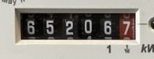

# Raspberry Pi + .NET + Digital (GPIO) Input Pin
## Introduction
In this episode we'll look at using the Raspberry Pi to write some C# code to read real-time consumption data from a dumb power/electricity meter, effectively turning it into a smart meter.
## Recap
In previous episodes, our development tool was Visual Studio Code, a tool that can run on a variety of opertaing systems, although in my/our case we ran it on Windows. During the build we published to the Raspberry Pi platform (`linux-arm`), copying the files to the Raspberry Pi over a network share and then executing/debugging remotely. On reflection, this is a klunky method so I've been looking for alternatives. Options included;
### Visual Studio Code - Running on Raspberry Pi
This doesn't quite fulfill the criteria, as it means that the development is solely on the Raspberry Pi. It also means that you need to load up and install the Desktop UI just for this purpose. My preference is to have a bare bones Pi that is headless.
### Visual Studio Code - Remote Development
In this case you can load up the `Remote - SSH` extension and configure to run your development over an [SSH connection](https://code.visualstudio.com/docs/remote/ssh) to your Raspberry Pi. Effectively using Visual Studio Code as a `thin client` to a backend running on the Raspberry Pi. The challenge here is the SSH configuration, ports, etc. 
### Visual Studio Code - Remote Tunnel
In December 2022, Microsoft brought out Version 1.74 of Visual Studio Code and also made the `remote-tunnel` extension available. Again, this introduces the concept of using Visual Studio Code on your Windows system as a `thin-client` communicating over a `tunnel` to something called the [Visual Studio Code Server](https://code.visualstudio.com/docs/remote/vscode-server). You can think of the VS Code Server as a Command Line Interface (CLI) version of Visual Studio Code. Functionally, the development environment will reside on the target machine (the Raspberry Pi), including extensions, and all that is required on the Windows machine is the `remote-tunnel` extension. There is a caveat to using the tunnel and that is, you need a GitHub account, however, a couple of benefits ensue; 1) you no longer need network connectivity between your Windows and Raspberry Pi, the two can be seperated, for example, maybe you're travelling, and 2) you can use a web based version of Visual Studio Code. In summary, this is what remote tunneling looks like:\

Not all the components to install Tunnels have made final release yet, so some components are available as Release Candidates and others as Insiders (pre-release). I've assembled the instructions together so that you can get going quickly. But first, let's talk .. electricity meters.
## Electric meters
I've been waiting for a smart meter to be made available and installed for over 12 years. Even more so now, with energy prices rising, it's important to understand consumption with a view to give insight and help drive usage down. A UK government regularly reports Smart Meter [statistics](https://www.data.gov.uk/dataset/ed44b45d-6651-4767-9f73-92abd3f51e48/smart-meters) with the [Q2 2022 report](https://assets.publishing.service.gov.uk/government/uploads/system/uploads/attachment_data/file/1099629/Q2_2022_Smart_Meters_Statistics_Report.pdf) highlighting that as of 30 June 2022, there were a total of 23.7 million gas meters and 28.7 million electricity meters operated by large energy suppliers in domestic properties across Great Britain and of those 28.7m electricity meters, 13m were non-smart, roughly half. Typically, these non-smart/dumb meters have a `digital` display \
 \
allowing consumers to report their actual (vs estimated) consumption to their energy supplier. The display represents consumption of power over a time period, eg a Kilowatt of power over an hour (kWh). The energy supplier will have a rate they charge for consumption of energy, in my case: 49.59p/kWh or £0.4959/kWh. So, we have consumption via the digital display, but that's not very useful for integrating with external technology (our Raspberry Pi). WHat most dumb meters proivide is a point of integration, mostly through a flashing LED. My meter is a [Itron ACE1000 SM0](https://www.mwatechnology.com/wp-content/uploads/2015/07/Itron-ACE1000-SMOP.pdf) and the LED will pulse 800 times for every KWh of consumption, ie, each pulse is 1/800th of a Kilowatt Hour. Different meters have different pulse rates, ranging anything from 500 to 4000 pulses per kWh. For details, google your meter model and find the datasheet. The liklihood though is that the pulse count is annotated next to the LED output.
## Optical Sensor
Next, we need to find a sensor, capable of detecting the LED flash. It would be possible to handcraft something using a light sensitive sensor, or, buy a purpose built meter sensor. To give you some ideas, here is a selection:
- [Optical Utility Meter LED Pulse Sensor from SheepWalk Electronics](https://www.sheepwalkelectronics.co.uk/product_info.php?products_id=77)
- [Electricity meter optical pulse sensor Manufactured by Tensor plc](https://www.madeinbritain.org/products/item/electricity-meter-optical-pulse-sensor) - This looks great, but can't find where to buy
- [DIY Guide to Power Monitoring using a Raspberry Pi](https://mdbind.com/blog/2021/01/power-monitoring-using-a-raspberry-pi/)
- [DIY Guide to Pulse Meter Pulse Sensor](https://www.mysensors.org/build/pulse_power)
- [Optical Utility Meter LED Pulse Sensor from OpenEnergyMonitor Shop](https://shop.openenergymonitor.com/optical-utility-meter-led-pulse-sensor/)

